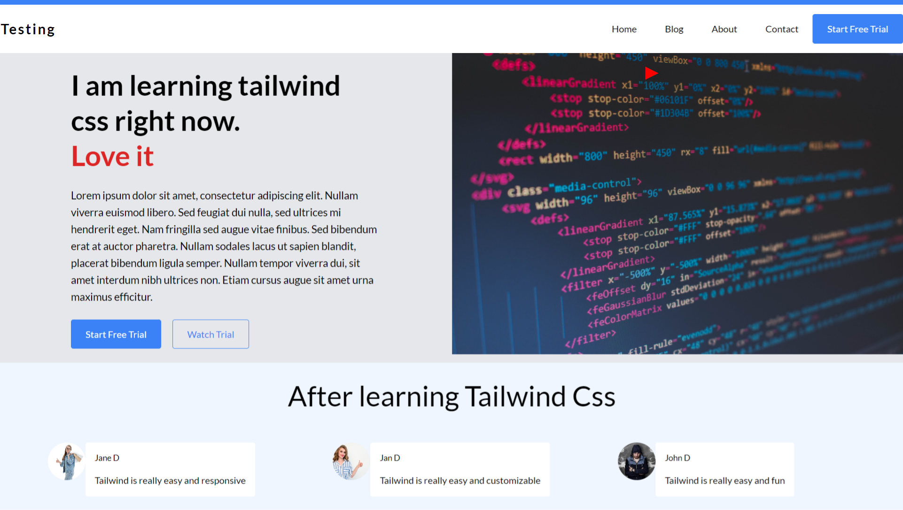

# Tailwind Learning Project

## How to set up the project

For you to run this project you need to have the npm installed, if you need help you can checkout [this tutorial](https://phoenixnap.com/kb/install-node-js-npm-on-windows).

After having npm run the `npm install` on the terminal. Lastly you can create the server with the `live-server` command on the terminal this will create the server at [http://127.0.0.1:8080](http://127.0.0.1:8080).

Final version can be seen from the screenshot:

